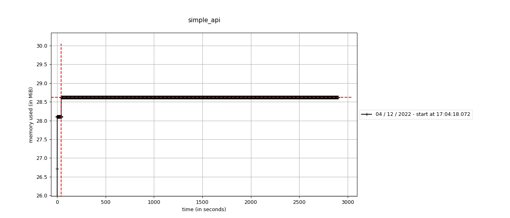

# Simple FastAPI service

Minimal reproducible example to showcase [Issue #1624](https://github.com/tiangolo/fastapi/issues/1624)
> The memory usage piles up over the time and leads to OOM

## Requirements

* Python 3.10.8
* Poetry
* Docker

## Setup

* building the wheel within a py 3.10 docker container  
  (Note: you can skip this step, wheel available in repo)
    ```bash
    docker run --rm -v $PWD:/repo -w /repo -it python:3.10 bash
    pip install poetry==1.2.2
    poetry build -f wheel
    ```
* building the docker image
    ```bash
    docker build -t simple_api_starlette .
    ```
* starting up the container
    ```bash
    docker run --rm -p 8080:8080 --name simple_api_starlette simple_api_starlette
    ```
* keep an eye on docker memory usage
    ```bash
    docker stats
    ```
* send random sized requests to the service
    ```bash
    ./send_mixed_requests.sh
    ```

## Track memory increse over time

* starting the server
    ```bash
    docker run --rm -p 8080:8080 -v $PWD:/repo -w /repo -it python:3.10 bash
    pip install dist/*.whl
    pip install memory_profiler
    mprof run simple_api
    ```
* send random sized requests to the service
    ```bash
    ./send_mixed_requests.sh &
    # wait a few minutes
    ./send_mixed_requests.sh "ceci est un texte aléatoire. " &
    # wait a few minutes
    ./send_mixed_requests.sh "Dies ist ein Zufallstext." &
    ```
* stop the server and plot the memory increase
    ```bash
    mprof plot
    ```

Sample plot: 